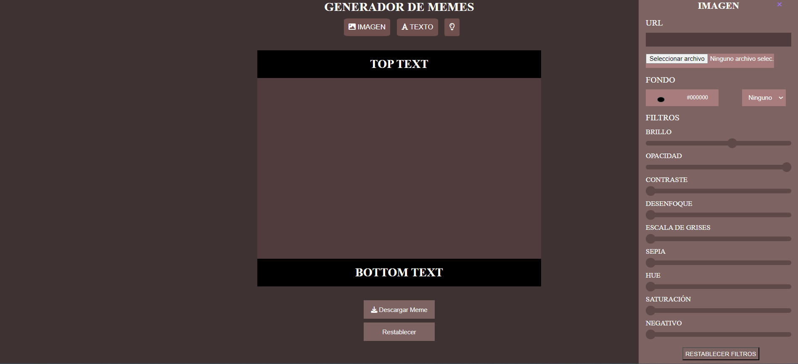
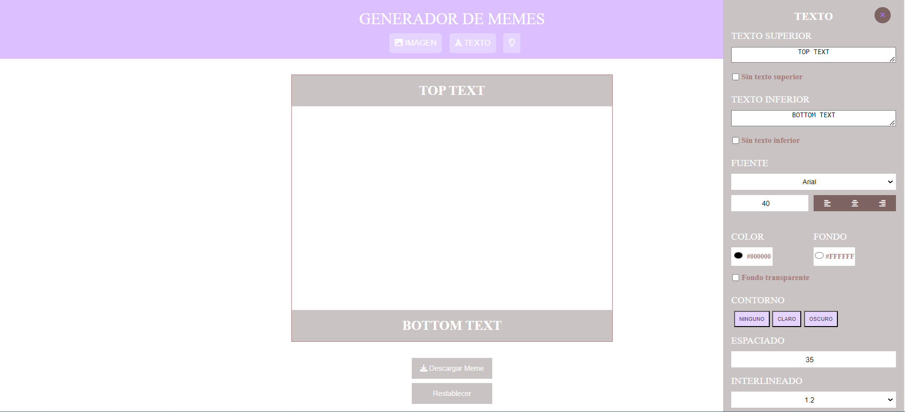
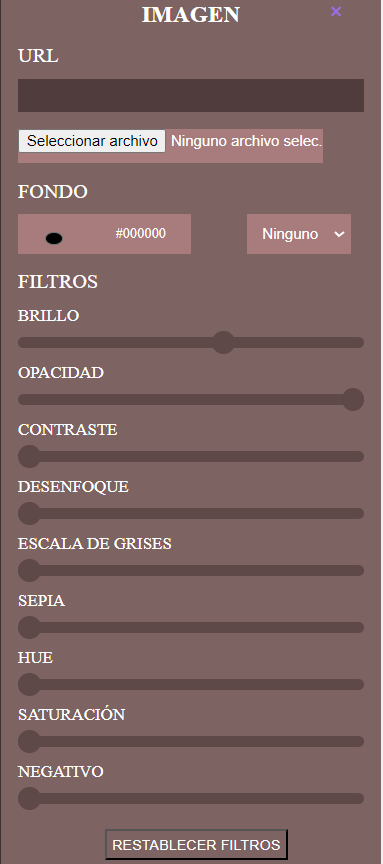
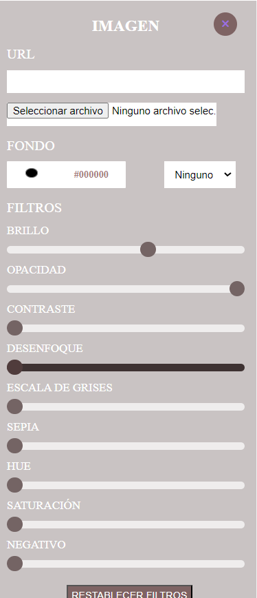
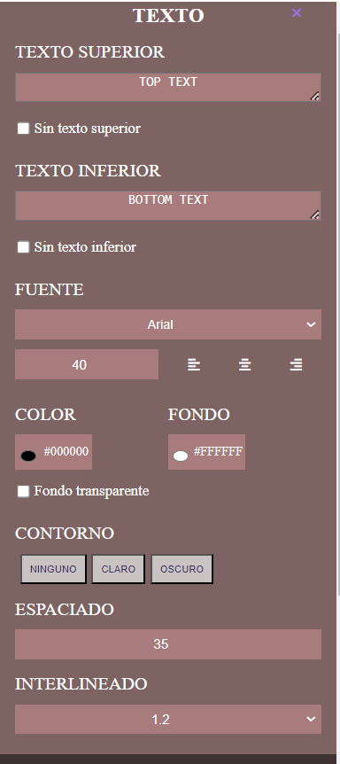
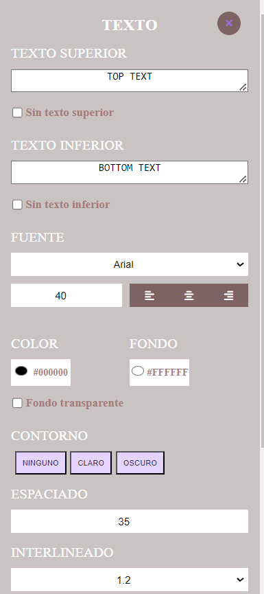
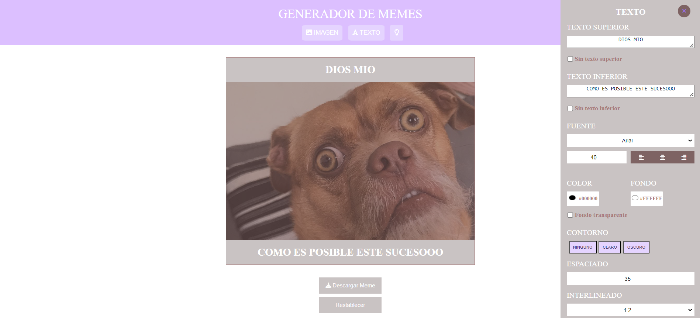
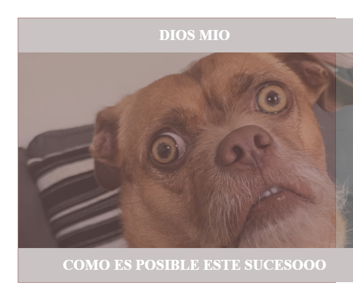
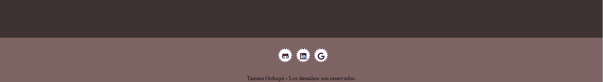
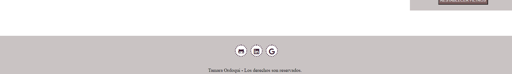

# Generador de memes

En esta ocasion, podras cargar una imagen desde tu ordenador / celular o utlizando la URL de una imagen para convertirla en un memes. Podras colcoarle filtros, texto superior e inferior, editarlo a tu gusto y descargarlo tanto en tu celular como en tu computadora! A divertirse!
Tambien podras elegir modo claro y oscuro!
## Secciones 

### Contenedor General:
Pagina principal en ambos modos, claro y oscuro., 

### Panel Edicion de Imagen : 
En esta sección podras editar la imagen de tu meme, otorgandole filtros. 

🛠️Filtros: 

- BRILLO 
- OPACIDAD
- CONTRASTE
- DESENFOQUE
- ESCALA DE GRISES
- SEPIA
- HUE
- SATURACION
- NEGATIVO

### Panel Edicion Text :

Podras editar el texto que le coloques a tu meme!

### Meme Ejemplo:
Aqui podemos ver como colocamos y editamos una imagen. 

### Meme Resultado:
Aqui vemos como se verá la imagen cuando la descarguemos.

### Contacto:
📩 A continuación se verán los medios por donde podrás contactarme, si así lo deseas.

## Licencia : 
Este proyecto es realizado por Tamara Ordoqui, todos los derechos son reservados. 
